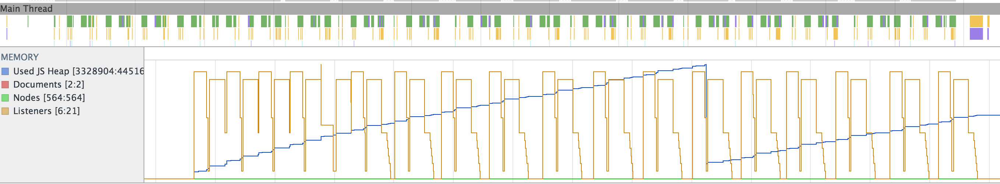
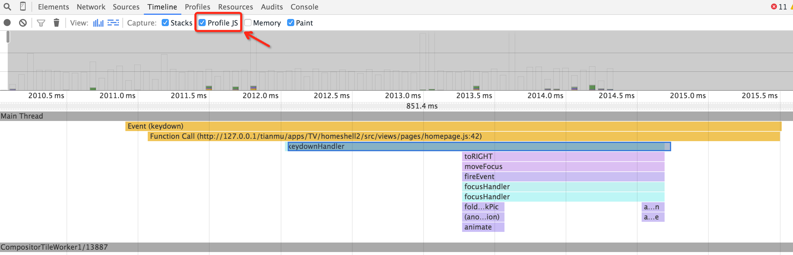
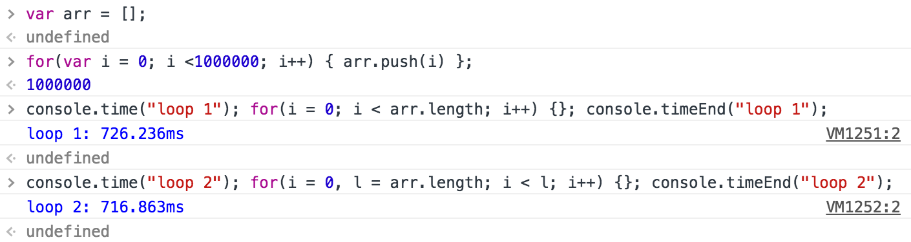
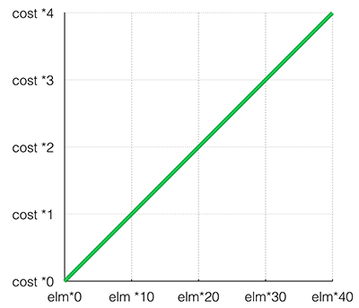
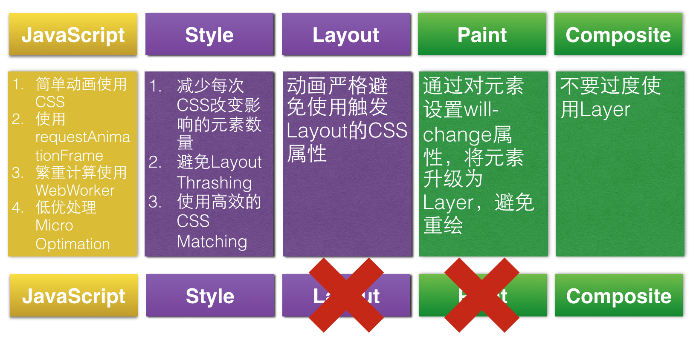
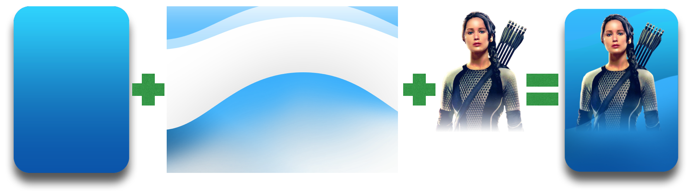
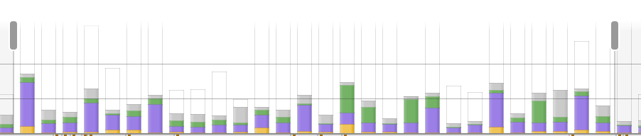
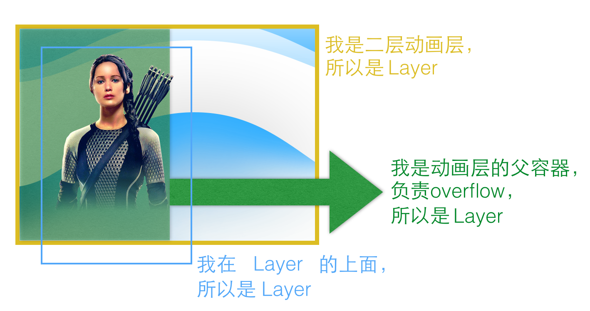

# H5动画60fps之路
### 概述
最近一直在做H5的动画性能优化，众所周知，在移动端，和Native对比，H5在一直都被人吐槽性能差，尤其是在动画方面。百度的nwind有一篇文章《[聊聊移动端跨平台开发的各种技术](http://fex.baidu.com/blog/2015/05/cross-mobile/)》介绍了目前移动端的几种流派，在介绍Web流时，他也谈到Web慢的几个原因，有兴趣的同学可以看看。

不过既然大家都说H5慢，那我们就看看，H5究竟能到多快？

谈到整个Web App的生命周期，一般分为四个部分，加载（Load），等待用户（Idel），响应用户（Response）和动画（Animation）。

一般情况下，首屏加载的时间应该小于1s，而响应用户行为的时间应该小于100ms，动画应该达到60fps。Web App的性能优化是个很大的话题，这篇文章只针对动画60fps的优化。

### 关键渲染路径
动画性能高，从直观体验上是动画没有抖动和卡顿，从数字上是渲染达到了60fps。60pfs就是每秒60帧，所以每帧的时间只有1000ms / 60 = 16.67ms。但是实际上，浏览器在每一帧还要做一些额外的事情，所以如果要达成60fps，我们需要保证每一帧的时间在10ms到12ms。

我们先来看看浏览器的每一帧渲染都做了哪些事情。
#### 1.JavaScript
动画大多是由JavaScript触发的，比如改变位置、尺寸等等，现在大多数开发者使用CSS Animation，CSS Transition，这些动画只在开始的时候会执行JavaScript，动画过程中的每一帧都不会再有JavaScript的执行。但是CSS的动画接口是比较有限的，在现阶段和Native比还差很多，比较复杂的动画如果CSS不能完成，就需要使用requestAnimationFrame函数，这样每帧都会有JavaScript的计算。
#### 2.Style
当一个新的样式应用到Dom上的时候，就会引起Style的计算，同JavaScript，如果开发者使用CSS Animation，CSS Transition，那么浏览器只有在动画开始之前会做Sytle的计算，而requireAnimationFrame会在每帧都计算
#### 3.Layout
当新的CSS样式触发了Layout，比如修改了width, height, position，这时浏览器需要重新Layout受到影响的元素，大部分情况下，即使一个位置很远的元素发生很小的宽度改变，也会引起整个document的Layout，这在动画里是一个性能非常低的实现，应该尽量避免。
#### 4.Paint
Layout变化后，受到影响的元素会重新Paint，如果遇到首次加载图片，浏览器需要将图片先解码放入内存（Image Decode）。Painting是在多个Surface上进行的，最后会出来多个Layer。
#### 5.Composite
最后一步Composite就是把已经Paint好的各个Layer合成到一起。浏览器会将每个层分成多个Tiles去Paint，但是这些作为H5开发者来说是不能够控制的，这些层和Tiles信息会被传到GPU，最终由GPU负责渲染并显示在屏幕上。

### 三条路
并不是每一个的CSS的变动引起的渲染过程都要经历以上全部，实际上有三条路可以走。

第一条路，比如修改元素的width，这些步骤都会执行：

    .scale {width: 100px;}

第二条路，比如修改元素的background-color，不会有布局的变化，不会触发Layout，但是会发生Paint：

    .highlight {background-color: red;}

第三条路，修改元素的transform，不会触发Layout，也不会触发Paint：

    .scale {transform: scaleX(2);}

当我们要完成一个动画时，可能有很多种实现的方式，比如让一个小球向右平移100px，我们可以用以下这些方法：

    .move-forward {left: 100px};
    .move-forward {margin-left: 100px};
    .move-forward {padding-left: 100px};
    .move-forward {transform: translateX(100px)};

问题就在这里，使用哪种方式性能最高？

从上面看出，如果使用不触发Layout和Paint的CSS属性完成动画，性能是最高的。那么哪些CSS属性不会触发Layout和Paint呢？推荐一个网站[CSS TRIGGERS](http://csstriggers.com/)，这里详细的列出了所有CSS属性在修改后是否触发Layout和Paint，是个非常给力的工具！

### 使用Chrome的DevTools调试
Chrome的DevTools是个非常强大的工具，开发者可以用它调试Dom结构，Debug JavaScript，网络抓包，性能调试等等，这里我们主要讨论动画的调试。

调试动画就要用到Timeline，这个工具网上的介绍很多，而且Chrome在最近几个版本（从40到45）对Timeline的功能做了很多升级，[Chrome的官网文档](https://developer.chrome.com/devtools/docs/timeline)对Timeline介绍非常详细，我列出3个非常实用的功能。
#### 1.查看每帧的时间
通过录制跟踪一段动画，可以看到每一帧的情况，找到耗时超过16ms的帧可以有针对性地解决问题。

比如这一帧一共耗时5.652ms，其中黄色JavaScript用0.703ms，紫色Rendering包括Style和UpdateLayer Tree一共1.561ms，这里面没有Layout，绿色Painting用了0.603ms，里面只有Composite没有Paint。

#### 2.查看内存
通过Memory工具可以查看内存的使用情况，对于内存泄露的检查是非常有帮助的。

这是多次在桌面滑动后的内存曲线，可以看到黄色的曲线表示Listeners的个数，没有增长，而蓝色的内存使用量在开始时不断上升，在中间靠后的位置突然下降，这是遇到了GC回收并释放了内存。

#### 3.查看CompositeLayer
通过Layer可以查看当前绘制的帧有多少需要Composite的Layer，Layer越多，带来的Upate LayerTree和Composite Layer的时间就越长。

通过这个图的左边可以看到所有的Layer，中间的图可以非常直观地看到每个Layer的位置，右边列出这个Dom升级为Layer需要被Composite的原因。

### 优化方法
当我们已经熟练使用Chrome的DevTools工具分析动画性能后，找到了瓶颈点，那么就需要做有针对性的优化了。
#### 1.JavaScript优化
使用requestAnimationFrame

前面提到，如果动画性能达到60fps，那么每一帧的时间是16ms，浏览器会有一些额外的工作，所以要保证所有的事情在10ms到12ms完成，那么留给JavaScript的时间在3ms到4ms比较合适。

大多数比较早期的Web动画是用setTimeout/setInterval这两个函数实现的，包括著名的JQuery，那个年代也没有其它的API可以用。这种实现方式性能非常低效，因为JavaScript在处理setTimeout/setInterval时，不会和渲染流程联系起来，很有可能在一帧的中间突然执行JavaScript导致Sytle和Layout等后面的处理要重新进行而不能在16ms内完成全部。

但是现在不同了，我们有了requestAnimationFrame，使用这个函数，动画每一帧在何时执行，如何执行，都由浏览器去决定，开发者只要把每次执行的工作写好就可以了。

    function animate() {
        // do something change here, like:
        // x += 0.1; element.style.opacity = x;
        requestAnimationFrame(animate);
    }

requestAnimationFrame(animate);
查看耗时较长的js，必要时使用WebWorker

通过Chrome的DevTools的Timeline，勾选Profile JS，可以看到每一个函数执行的时间。（需要Chrome 41+）参考截图，用时精确到函数级，这样可以更精准的定位问题。

如果在动画执行过程中，有额外的大量JavaScript计算，为了不影响动画，建议将大量计算的JavaScript放入WebWorker。WebWorker是个功能有限的实现JavaScript多线程的工具，Worker和主线程通过message事件和postMessage方法通讯，API可以参考[WebWorker](https://developer.mozilla.org/en-US/docs/Web/API/Web_Workers_API/Using_web_workers)。

**低优处理Micro Optimization**

网络上有一个观点，我是比较赞同的，就是**不要把过多精力放在Micro Optimization上**，什么是Micro Optimization呢？我们来看一个老生常谈的例子：

    //loop 1
    for (var i = 0; i < largeArray.length; i++) {}
    //loop 2
    for (var i = 0, l = largeArray.length; i < l; i++) {}

大家都知道loop1比loop2的执行效率低，因为后者不用每次都去读数组的长度。

这种性能上的差异，在低版本的浏览器中非常明显。在PC浏览器争雄时代，如何写高性能JavaScript是个非常热门的话题，但是随着各个JS引擎的发展，大多数性能问题已经在引擎内部解决，开发者不需要关心这些Micro Optimization。如今在Chrome上我们再次比较这两种写法的性能，会惊奇的发现没有差别，V8已经把差异在内部处理了。

下面这个例子，循环一百万次，两种写法没有差别。

V8的编译属于Just In Time Compilers，会在代码一行一行执行的时候不断做一些优化。绝大多数H5开发者并不知道（也不需要知道）V8是如何翻译每一行代码的，但是作为开发者我们相信V8会为我们处理更多语言级别的优化，而我们需要把精力集中到业务上的优化中。

### Style优化
元素数量和性能的关系

首先需要明确的一个问题，修改CSS后，影响的元素数量和浏览器为此花费的代价是怎样的关系？请看图：

从图上看，这个变化是线性的，也就是说，浏览器花多长时间处理Style的计算取决于有多少元素受到了影响，所以改变1000个元素的Style所耗费的时间，是改变10个元素的100倍。

有了这个结论，我们在做每个动画时，要确保每次改变CSS时，所影响的元素都是我们需要改变的，不要改变和动画无关的元素。

**避免Layout Thrashing**

什么是Layout Thrashing？先看一个例子：

    for (var i = 0; i < elements.length; i++) {
        var blockWidth = baseElement.offsetWidth;
        elements[i].style.width = blockWidth;
    }

这是一个性能很低的例子。

当开发者设置了一个CSS样式，浏览器会继续等待看有没有更多的样式改变，然后在接下来的一帧来个批处理。比如同时设置了top, left, width和height：

    element.style.top = "100px";
    element.style.left = "100px";
    element.style.width = "300px";
    element.style.height = "200px";

当浏览器把这四个样式都读完，发现没有其它样式改变了，才开始做渲染，也就是前面提到的从Style到 Layout到Paint到Conposite这一系列过程。

我们再看上面那个性能低的例子，设置好一个新的样式，接着让浏览器去读一个Layout，这样浏览器就不能等待多个样式的批处理，而是强制让它先把刚才的样式做渲染，这样一读一写地循环下去，性能是非常低的，叫做“Forced Synchonous Layout”。

这个例子修改起来非常简单，只要把读Layout的事情放在循环外就好了。

    var blockWidth = baseElement.offsetWidth;
    for (var i = 0; i < elements.length; i++) {
        elements[i].style.width = blockWidth;
    }

关于Layout Thrashing和Forced Synchonous Layout，可以参考[Preventing 'layout thrashing'](http://wilsonpage.co.uk/preventing-layout-thrashing)，还推荐一篇文章[How (not) to trigger a layout in WebKit](http://gent.ilcore.com/2011/03/how-not-to-trigger-layout-in-webkit.html)讲述了哪些JavaScript操作会触发Layout。

**更快的CSS Matching**

关于CSS Matching，网络上也有一个观点，[Pixels are expensive](https://aerotwist.com/blog/pixels-are-expensive)这篇文章提出，“For the most part optimizing selector matching is going to give minimal returns.” 针对这个观点我做了一些测试，在大多数情况下，这个优化确实非常有限，当页面上Dom非常多，1000个以上的时候，优化的作用会显现出来。

我们看这个例子，可以点进去看源码。有10000个div的页面，通过querySelecor获取到最后一个div里的title。

    div.box:not(:empty):last-of-type .title
    .box--last > .title-container > .title
    .box:nth-last-child(-n+1) .title

测试发现第二种写法性能是最好的，不过这个例子并不具有广泛的代表性，因为这种大页面不该出现在Web App中，更好的设计应该是不断回收在屏幕外的Dom。

业界有个针对CSS Matching的高性能框架叫做[BEM](https://en.bem.info/method/definitions)，对于初级开发者需要一点学习成本，不过思路是可以借鉴的。

### Painting和Composite优化
Painting是非常耗性能的，所以为了避免Painting，我们一般会把这个元素变成一个Layer，当它成为一个单独Layer后，就会独立出来，当在它后面的其他元素需要重绘时，它也不会受到影响，只是最后需要做Compisite合成。

这里我再次推荐[CSS TRIGGERS](http://csstriggers.com)，这个网站可以非常方便地查询修改一个CSS属性是否触发Layout或者Paint。

但是并不是Layer越多越好，这样会加重Composite的工作，所以开发者需要在Paint和Composite上找到一个平衡。

如何让一个元素成为一个Layer呢？目前有几种Hack的方式：

    .layer {
        transfrom: translate3d(0, 0, 0);
     }
    .layer {
        transfrom: translateZ(0);
    }

Chrome提供一个更好的方式，使用will-change，和上面不同，will-change不会直接把元素变成Layer，而是给浏览器一个提示，这可以让浏览器自己决定是否成为Layer，推荐这种方式：

    .layer {
        will-change: transform;
     }

推荐一篇Chrome官方的文章[GPU Accelerated Compositing in Chrome](https://www.chromium.org/developers/design-documents/gpu-accelerated-compositing-in-chrome)，这里面非常详细地讲述了从RenderObject到RenderLayer，到GraphicsLayer，最后变成Chrome Compositor Layers的一系列过程，非常详细，文章里提到的GraphicsLayer就是本文的Layer。

### 总结
上面分别从JavaScript, Style, Paint的过程介绍了一些针对性的优化方法，通过使用Chrome的DevTools，开发者可以针对渲染路径上的每一个步骤优化，相信一定会有非常好的效果。

我将这些优化点简单总结为一个图：

### 天猫魔盒的桌面及优化
#### 1.桌面动画的说明
我们来看看H5版本的天猫魔盒的桌面。

涉及的动画效果我简单做个说明：

+ 白色的聚焦框会在左边的视频和右边的卡片切换，切换时，聚焦框的位置、宽度、和边框的图片会发生改变。
+ 卡片的背景是由三张图片构成的，分别为底色背景，中间纹理和上层的人物画像，在卡片聚焦时，中间的纹理会根据业务需求做平移或者缩放的动画。
+ 聚焦的卡片左边的卡片会向左平移，右边的卡片会向右平移。
+ 聚焦卡片的后面会飞出来6张小图片，并停在卡片的边上。

#### 4.优化点及效果
聚焦框的宽度变化
前面介绍，这个框的动画要改变框的位置、宽度和边框的图片，其中，改变边框图片是不需要动画的。

**方案一**

这个动画最原始的方案是改变这个框的transform中translate3d的x的值，和框的width。

    transition: transform 500ms ease, width 500ms ease;
    transform: translate3d(776px, 0, 0);
    width: 360px;

前面提到，修改width会引起Layout，从而引起Paint，性能非常低，要尽量避免使用，所以这个方案很快被废弃。

**方案二**

修改聚焦框的transform中的translate3d中的x和scaleX.

    transition: transform 500ms eas;
    transform: translate3d(776px, 0, 0) scaleX(3.32);

这样做动画性能提高了不少，但是左右两个边框的宽度也会被拉伸，出现失真，所以该方案也废弃掉了。

**方案三**

如何在保证功能不失真的前提下提高动画的性能呢？那么只能把聚焦框分成三个部分，左中右，左边跟着父容器做比较大的平移，中间做沿x轴的放大，右边做比较小的平移。

虽然dom结构变复杂了，对应的graphic layer会增多，但是动画的性能会有显著提升。

    .focus-anchor.video-anchor.part {
        border-image-source: url(../resources/images/focus.png);
    }
    .focus-anchor.video-anchor {
        transform: translate3d(776px, 0, 0);
    }
    .focus-anchor.video-anchor .right-border {
        transform: translate3d(511px, 0, 0);
    }
    .focus-anchor.video-anchor .middle {
        transform: scaleX(3.32272727);
        transform-origin: left;
    }

总结

这个优化点使得聚焦框从视频到卡片的滑动流畅了很多，帧率提高了10帧，从这个例子看出，动画一定不能使用导致Layout的属性。

二层动画的引入

二层动画问题

二层动画，是卡片里三层背景中，中间纹理的动画，在卡片聚焦时，该纹理会有平移或缩放的动画。

这个动画看着很简单，似乎只是对中间那层做一个tanslate就可以了，在PC上调试的时候也很顺利，然后到了天猫魔盒上却出现了非常严重的掉帧，从原本的60fps降到35fps。

从Chrome的devTools工具中的Timeline可以看到增加二层动画前后的数据。

加入二层动画之前：

加入二层动画之后：

这个动画加入之后，动画的每帧，在update layer tree和composite layers上都花了比较长的时间。

在分析原因之前，让我们先看看每个卡片的html结构：

    <li class="app">
        <!-- 这里是后面的6张图片 -->
        

            
            
            
            
            
            
        

        

            <!-- 这是最后面的背景图片 -->
            

            <!-- 这是中间动画背景的父容器，需要做overflow:hidden来裁掉子元素。 -->
            

                <!-- 动画背景 -->
                

            

            <!-- 动画背景前面的人像和文字 -->
            

                <h2>购物</h2>
                
webgl的购物demo

            

        

    </li>

前面已经提到过Layer的概念，在二层动画引入前，div.app-content是一个Layer，里面的三层背景和文字都在这个Layer中。

二层动画引入之后，

div.app-grain会做tanslate3d平移，所以它升级到一个Layer；

div.app-grain-container由于是Layer的祖先，所以也会升级到Layer；

div.app-photo由于需要覆盖到div.app-grain-container这个Layer上，也升级为Layer。

所以一个小小的动画一下子加了3个Layer，而整个Homeshell一共有7张卡片，所以动画的每帧需要多处理21个Layer的计算和合成，这对于GPU是一个不小的开销。

解决方案

针对GraphicsLayer的个数做针对性的减少，由于在平移过程中，只有正在聚焦的这一张卡片是需要做二层动画的，其它的卡片不需要引入这么多Layer，所以在非聚焦的时候，需要去掉触发升级为Layer的属性。

    div.app-grain {
        /* will-change: transform; */
    }

当然这么做也是有一点代价的，每个卡片在聚焦时，1个Layer会变成3个Layer，这时需要Paint，而动画结束时，3个Layer变回1个Layer也需要Paint，而这两个Paint，只发生在动画的开始和结束，不是每一帧都要做，所以性能损失很小。

总结

并不是Layer越多性能越高，也不能要盲目地避免Paint，遇到性能问题，通过devTools工具分析性能瓶颈，做有针对的优化，才是提升性能最有效的办法。注释一行代码，动画帧率从原来的35fps上升到55fps。

### 写在最后
H5的动画可以做得很好，当然这需要比较高的门槛，这几年中，如何提供框架能让更多的初级开发者写出高性能的APP已经是很多公司正在努力的方向，比较著名的有[FamousEngine](http://famous.org/)。

另外[Web AnimationAPI](http://www.w3.org/TR/web-animations/) 的草案已经制定，这个强大的动画模型提供的API足以和native抗衡，希望很快能被浏览器支持。

H5的路虽然很长，但是前景越来越好，作为一个H5开发者，我也希望以后Web App的生态能够繁荣昌盛。
