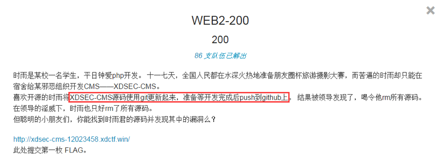

# XDctf2015 web2
### 题目

[源码地址](https://gitcafe.com/JJjie/JJjie/tree/gitcafe-pages/ctfcode/xdctf2015/web2)

### 解析
1. `.git`文件没有删除，存有所有git代码的记录，获取里面的关键值可以还原git仓库中的代码

2. `.git/logs/HEAD`存有所有的提交的信息，`.git/objects/`下就是文件目录数了，知道这些，通过遍历树便可以还原代码

3. `.git/ORIG_HEAD`初始的根，开始遍历

### 开始破解

破解脚本见源码地址

[点击此处打开gitcafe仓库](https://gitcafe.com/JJjie/JJjie/tree/gitcafe-pages/ctfcode/xdctf2015/web2/get_objs.py)

透过源码遍可以解出flag
